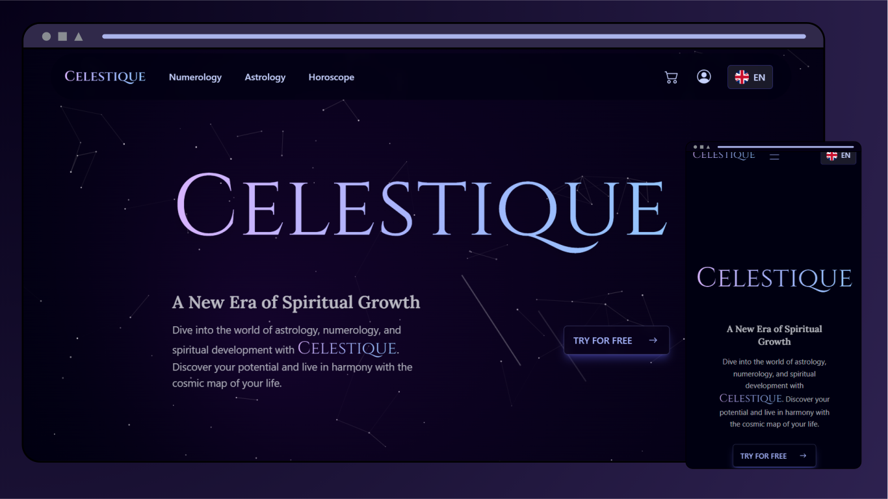
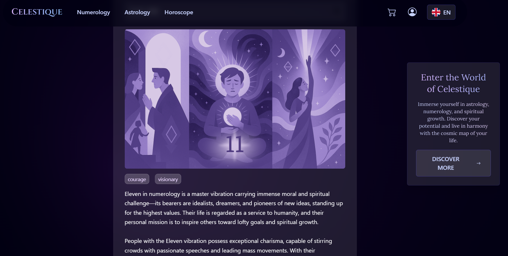
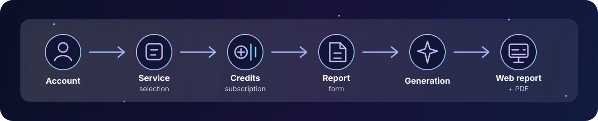
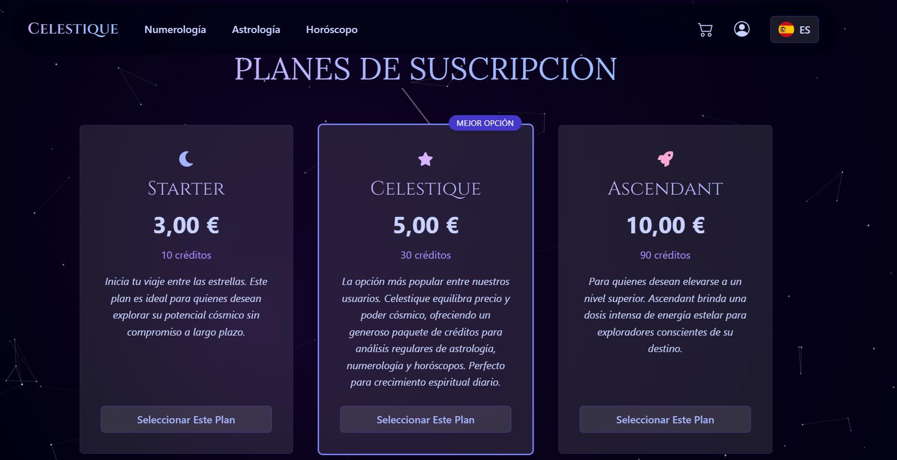
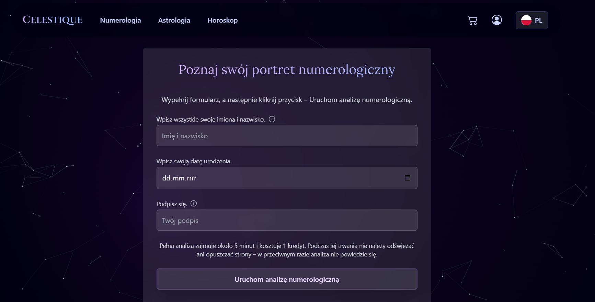
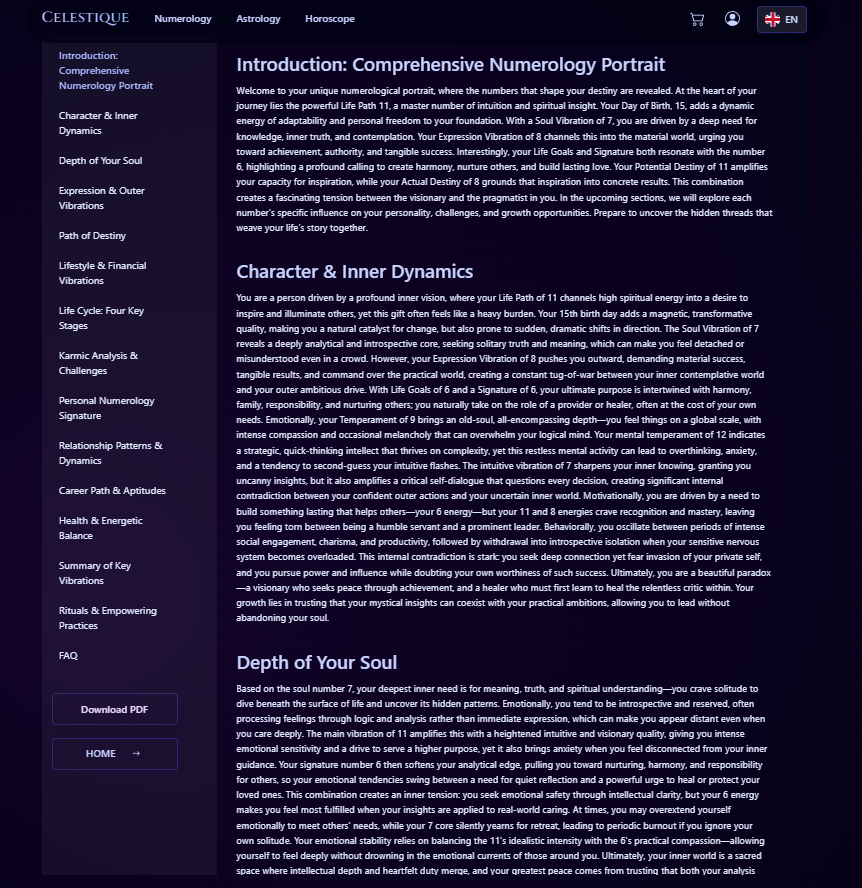
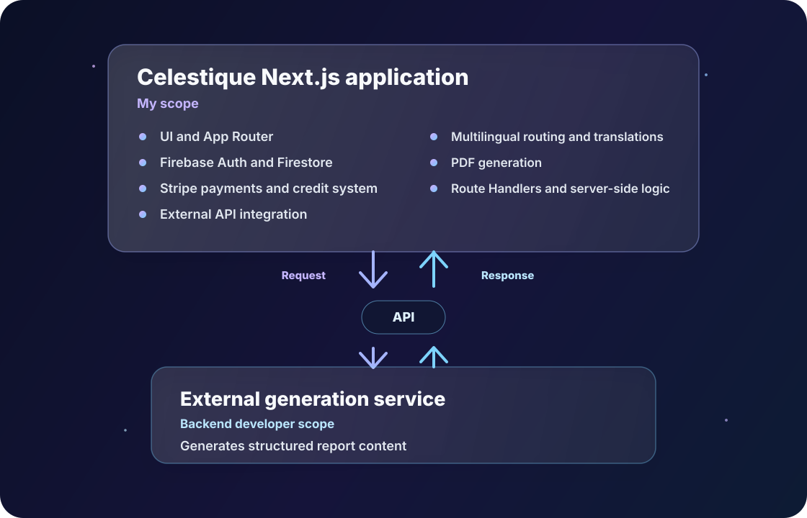

# Celestique - case study

  

## Project snapshot

**Product:** Celestique - commercial self-discovery SaaS  
**Role:** Next.js Full-stack Developer  
**Team:** 3 people - Next.js full-stack developer, backend developer / product owner, graphic designer  
**Repository:** private  
**Main stack:** Next.js, React, TypeScript, Tailwind CSS, Firebase, Firestore, Stripe, next-intl, React PDF

Celestique is a web application for generating personalized numerology, astrology and horoscope reports. The product guides users through a complete paid flow:

**Registration -> service selection -> access purchase -> form submission -> report generation -> in-app result + PDF export**

The source code is private, so this case study focuses on my responsibilities, architectural boundaries and product decisions without exposing internal endpoints, secrets or implementation details.

## Product Context

The goal was to turn a manual, consultation-like process into a self-service web product. Instead of contacting a specialist and waiting for a custom report, users can create an account, buy credits or a subscription, fill in a form and receive a structured analysis inside the application.

The main product challenge was not only displaying generated content. The application had to connect several critical flows: authentication, paid access, credit balance, long-running generation, multilingual content and downloadable PDF reports.

  

## My Role and Collaboration

I worked on Celestique as the developer responsible for the Next.js web application. My scope included both the frontend and the server-side logic living inside the Next.js app.

The team consisted of:

- **Me:** Next.js application, UI, App Router structure, server-side route handlers, payments, credits, authentication integration, multilingual UI and PDF generation.
- **Backend developer / product owner:** external analysis-generation service and final product decisions.
- **Graphic designer:** illustrations and visual assets used in the interface.

I did not implement or modify the external service responsible for generating the analysis content. I integrated with it through an API: preparing request data, sending generation requests, handling responses and errors, and presenting the generated reports in the web application.

Product decisions were discussed together with the backend developer / product owner. We aligned on user flows, credit usage, form scope, paid access and report presentation. The product owner had the final decision-making responsibility, while I translated those decisions into working application flows.

## Scope of My Work

My main responsibilities were:

- designing the application structure with Next.js App Router,
- building responsive UI for landing pages, service pages, forms, account views and report screens,
- implementing authentication flows with email/password and Google login,
- connecting user profiles with Firebase Authentication and Firestore,
- designing and implementing the credit system inside the web application,
- integrating one-time payments and subscriptions with Stripe,
- implementing server-side logic for users, credits, payments and protected operations,
- integrating the application with the external analysis-generation API,
- implementing multilingual routing and translations,
- generating PDF reports from dynamic analysis content,
- handling loading states, errors and longer generation flows,
- adapting the interface to the visual direction and illustrations prepared by the designer.

## Core User Flow

The most important flow in the application connects product, payment and report generation:

1. The user creates an account or logs in.
2. The user chooses a service, such as numerology, astrology or horoscope.
3. The user buys credits or subscribes to a package.
4. After a confirmed payment, the application updates the credit balance or subscription status for that user.
5. The user fills in a form with data required for the selected report.
6. The application checks access and sends a generation request.
7. The user waits while the report is being generated.
8. The result is displayed in structured sections.
9. The user can export the report as a PDF.

This flow required the UI and server-side application logic to stay consistent: the user had to see the correct credit balance, understand the cost of an action, be blocked when access was missing and receive clear feedback during longer operations.

## Selected Technical Challenges

### 1. Payments and Credits

**Problem:**  
The product offered multiple paid services, one-time packages and subscriptions. The interface had to make the payment model understandable while the application protected paid actions from being triggered without access.

**My responsibility:**  
I implemented the credit flow in the Next.js application: account state, credit balance display, protected service access, Stripe integration and server-side credit and purchase operations.

**Implementation:**  
The application uses credits as an internal access model. Users can buy credits or subscribe to a plan, then spend credits on different services. Payment-related operations are handled server-side, while the frontend reflects the current balance, package choice, loading states and errors.

  

**Outcome:**  
The result is a reusable monetization flow that supports several service types without forcing the user to pay separately before every single report.

### 2. Long-Running Report Generation

**Problem:**  
Generating a full personalized report can take longer than a typical web interaction. A standard form submission experience would not be enough, because users need to understand that the process is still running and should not be interrupted.

**My responsibility:**  
I implemented the application-side generation flow: form submission, communication with the external API, loading screens, error handling and result presentation.

**Implementation:**  
The UI separates form input, waiting state and final result views. During generation, the application communicates clearly that the process may take time. Once the response arrives, the content is rendered as a structured report rather than as raw generated text.

**Outcome:**  
The user receives a more predictable experience around a long-running operation with a variable completion time: the app explains what is happening, reduces uncertainty while the report is being generated and turns the response into a readable product artifact.

### 3. Multilingual Reports and PDF Export

**Problem:**  
The product needed to support multiple languages not only in navigation and forms, but also in generated report labels, PDF content and product messaging.

**My responsibility:**  
I implemented multilingual application structure and PDF generation for report outputs.

  

**Implementation:**  
The application uses locale-based routing and translation files for interface text, forms, messages and report-related labels. PDF export converts dynamic report sections into a downloadable document with language-specific copy and formatting.

  

**Outcome:**  
Celestique can serve users in multiple language versions while keeping the report experience consistent between the web view and the exported PDF.

## Architecture Boundary

The project had a clear boundary between the Next.js application and the external generation service.

This separation was important during development. It allowed me to own the complete web product experience while integrating with a specialized backend service created by another team member.

## Quality and Reliability

Because the application included payments and paid access, I paid particular attention to critical user states:

- clear validation in forms before starting generation,
- loading and waiting states for longer operations,
- error states for failed payment, missing credits or failed generation,
- server-side protection for paid operations,
- consistent credit balance feedback in the UI,
- manual testing of purchase and generation flows,
- checking responsive layouts across key screens,
- verifying multilingual paths and translated report labels.

The project did not rely only on static pages. Most important screens depended on authentication state, payment state, credit balance, selected language and responses from external services, so testing the actual flows was essential.

## Outcome

Celestique became a working commercial web product rather than a static informational website. The application combined:

- account creation and login,
- paid access through credits and subscriptions,
- several types of generated reports,
- multilingual user experience,
- downloadable PDF reports,
- integration with an external generation service,
- responsive, brand-aligned interface.

The project required end-to-end ownership of a customer-facing Next.js application with real business logic, third-party integrations and clearly defined system boundaries.

## What I Learned

The biggest lesson was that product complexity appears at the connections between features. Authentication, payments, credits, generated content, translations and PDF export are manageable separately, but the real challenge is making them work together as one reliable user flow.

Celestique strengthened my experience in:

- full-stack development inside Next.js,
- designing user flows around paid access,
- integrating frontend and server-side logic,
- working with API boundaries owned by another developer,
- building multilingual application structure,
- translating product requirements into working UI states,
- collaborating with a product owner and designer.

## Project Summary

Celestique was a commercial Next.js application where I owned the complete web product experience, including UI, server-side application logic, authentication, payments, credits, multilingual support, PDF generation and integration with an external analysis service.

The project strengthened my ability to connect product requirements, business logic and third-party systems into one consistent user flow.
